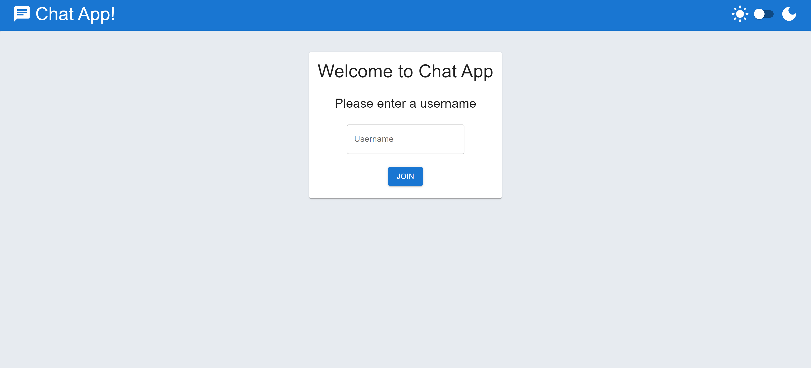
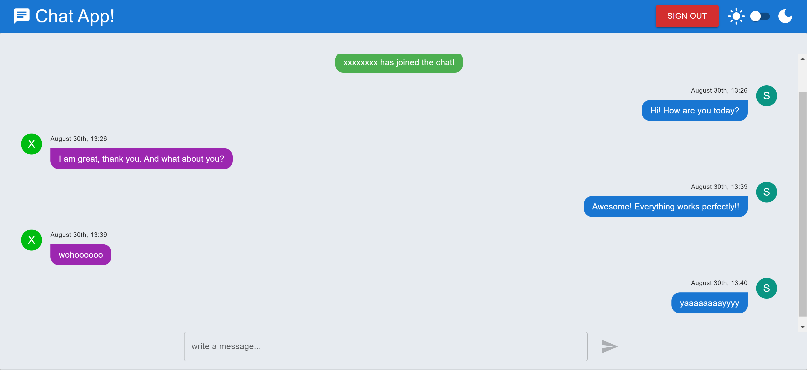

# Chat-App

## Table Of Contents
- [Chat-App](#chat-app)
  - [Table Of Contents](#table-of-contents)
  - [Introduction](#introduction)
  - [Technologies](#technologies)
  - [Installation](#installation)
    - [Client:](#client)
    - [Server:](#server)
  - [Screenshots](#screenshots)
    - [Home Page](#home-page)
    - [Chat Page](#chat-page)

## Introduction

Chat application to chat with other people in a single room.

## Technologies

* [React](https://reactjs.org/) v18.2.0
* [Material - UI](https://github.com/mui/material-ui) v5.14.4
* [Axios](https://github.com/axios/axios) v1.4.0
* [React-Router-Dom](https://github.com/remix-run/react-router) v6.14.2
* [Express](https://github.com/expressjs/express) v4.18.2
* [Sequelize](https://github.com/sequelize/sequelize) v6.32.1
* [Socket.io](https://github.com/socketio/socket.io) v4.7.2
* [Moment](https://github.com/moment/moment) v2.29.4
* [uuid](https://github.com/uuidjs/uuid) v9.0.0

## Installation

### Client:

Use the package manager [npm](https://www.npmjs.com/) to install Blog-App client.

```npm
git clone "https://github.com/yuvalitah/AvaTrade-Chat-App"
cd ../path/to/the/file
cd client
npm install
```
To start the project
```npm
npm start
```

### Server:

Use Docker and MySql to run the relevant container for the server.

To pull and create the MySql docker image and container run:

```
docker pull mysql
docker run -d --name mySql-cont -e MYSQL_ROOT_PASSWORD=mysql123 -p 3307:3306 mysql:latest
```

To create the relevant database run:
```
docker exec -it mySql-cont bash
mysql -uroot -p (enter your password afterwards)
CREATE DATABASE chat;
```

**Note - You may change the container and MySql settings such as the name or password, but if you do please make sure you enter the right settings on  ```api\.env``` file**

After you have the relevant container running and working on your machine, you can start the server using npm:
```
cd ../path/to/the/file
cd api
npm install
npm start
```

## Screenshots

### Home Page


### Chat Page

